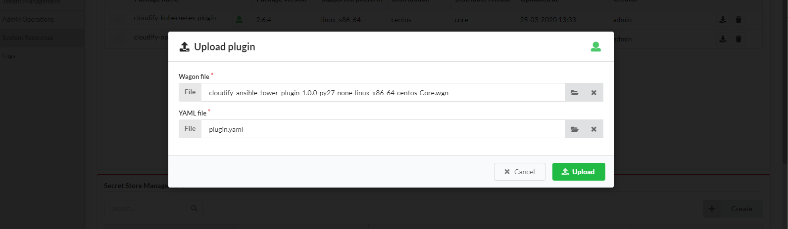
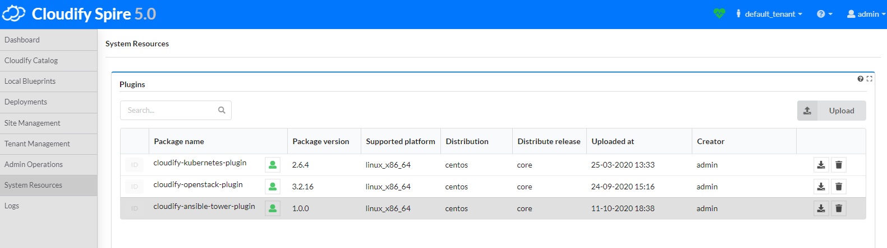
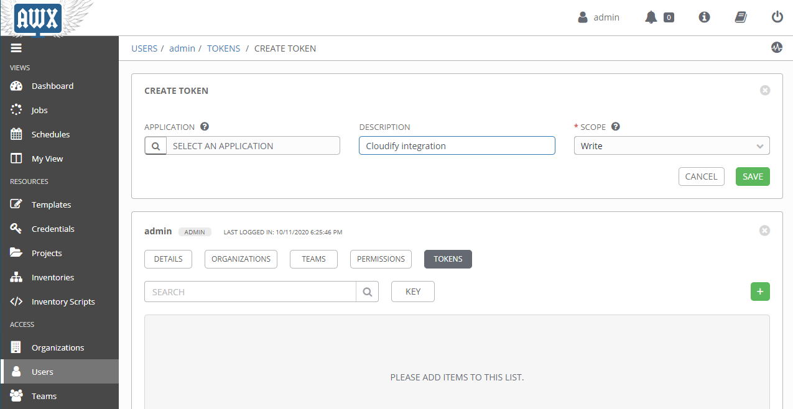
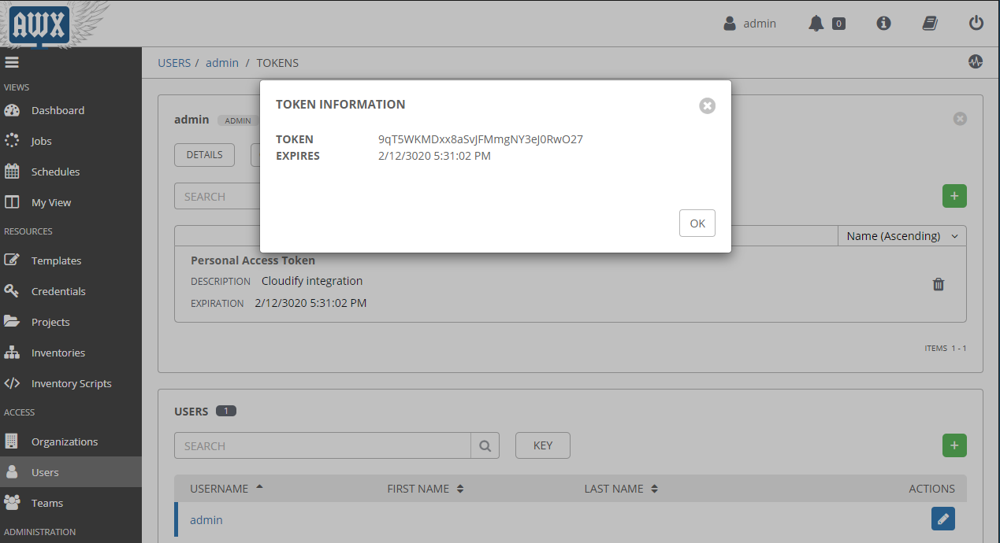
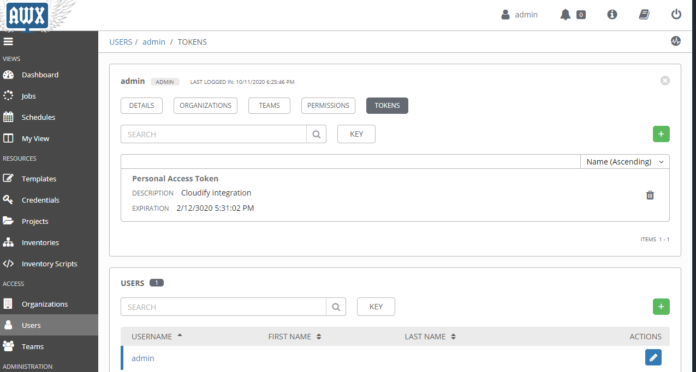

# Ansible Tower / AWX plugin for Cloudify

## Packaging

The _wagon_ and _plugin.yaml_ files are available in [Releases](https://github.com/cloudify-incubator/cloudify-ansible-tower-plugin/releases).  
Use them to upload the plugin into your Cloudify Manager.

## Importing

In Cloudify, go to the *System Resources* menu and click the *Upload* button within the *Plugins* widget. Use the Wagon file (.wgn) and plugin.yaml from the last section.

## AWX / Ansible Tower authentication

Cloudify needs to perform actions as a user within AWX / Ansible Tower. To do this, it needs a *Personal Access Token (PAT)*. Within AWX/Tower, go to the *Users* menu, click on the user you want to authenticate as, click the *TOKENS* top menu button, and click the *+ (plus symbol)*. 

Unless you have a specific use case, leave the *APPLICATION* field blank and change the *SCOPE* field to *Write*.

Then, you can save the Token value in the secret in your Cloudify Manager.
